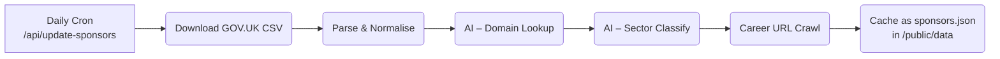

# Project Plan – UK Tech‑Visa Sponsor Finder

> **Goal:** Build a **fully serverless** Next.js (React 18 / App Router) web application that helps tech job‑seekers identify UK companies licensed to sponsor Skilled Worker and other tech‑friendly visas, enriched with AI‑verified websites & career links, refreshed daily from official GOV.UK data.

---

## 1 · Objectives & Success Metrics

| Objective                                                                     | KPI / Definition of Done              |
| ----------------------------------------------------------------------------- | ------------------------------------- |
| ⚡ **Speed** – deliver information in < 600 ms TTFB                           | Lighthouse Performance ≥ 90 on mobile |
| 🔍 **Findability** – users locate at least one relevant sponsor in ≤ 3 clicks | Usability test task success ≥ 90 %    |
| 📊 **Accuracy** – sponsor dataset matches Home Office list                    | Daily diff‑check Δ ≤ 0.1 %            |
| 📈 **Growth** – organic traffic via SEO                                       | 2000 unique users / month by M3       |

---

## 2 · Scope

### In Scope

- **Daily ingestion** of _Register of Licensed Sponsors: Workers_ CSV.
- **AI enrichment** for official domains, sector tags, career URLs.
- **Search & filter UI** for sector (IT default), visa route, region, query.
- **Serverless architecture** (Next.js API routes + Vercel Cron) – no custom backend.
- **Modern pastel‑tech UI** (Glitch‑style) with dark‑mode.
- **Local bookmarks** (localStorage) & shareable filter URLs.

### Out of Scope (v1)

- User authentication & cloud‑saved preferences.
- Email alerts / push notifications.
- Parsing individual job vacancies.

---

## 3 · Stakeholders & Roles

| Role               | Responsibility                      | Owner   |
| ------------------ | ----------------------------------- | ------- |
| Product Lead       | Vision, roadmap, acceptance testing | **You** |
| Front‑end Dev (×1) | Next.js pages, components, state    | —       |
| Data Engineer (×1) | CSV ingestion, AI pipelines         | —       |
| UI/UX Designer     | Style system, mock‑ups              | —       |
| DevOps             | Vercel config, monitoring           | —       |

---

## 4 · Technical Stack

- **Next.js 13+** (App Router) • React 18 • TypeScript.
- **Tailwind CSS 3** with custom colour tokens.
- **Zustand** for client state.
- **OpenAI GPT‑4o** API for enrichment.
- **Vercel** (Edge Functions + Cron) for hosting & schedules.
- **react‑window** for virtualised lists.

---

## 5 · Data Pipeline & Storage

- **Revalidation fallback:** ISR `{ revalidate: 86400 }` to re‑fetch if cron fails.
- **Diff‑check:** send Slack/Webhook alert if CSV row count deviates by > 5 %.

---

## 6 · API Routes

| Endpoint               | Method | Auth        | Description                                                                                   |
| ---------------------- | ------ | ----------- | --------------------------------------------------------------------------------------------- |
| `/api/update-sponsors` | POST   | Cron secret | Run full pipeline, write JSON.                                                                |
| `/api/companies`       | GET    | Public      | Query params: `sector, region, visa, q` – returns filtered slice. Edge‑optimised (RSC fetch). |
| `/api/health`          | GET    | Public      | `{ status: 'ok', lastUpdate: … }`                                                             |

---

## 7 · Front‑end IA & Pages

1. **Landing `/`** – Hero, live search demo, feature grid, pricing (free), FAQ, footer.
2. **Directory `/sponsors`** – SearchBar, FilterPanel, ResultsList.
3. **Saved `/saved`** – User’s starred companies.
4. **Guides** (`/guide/visa-basics`, `/guide/how-to-apply`).
5. Utility pages: 404, error boundary.

---

## 8 · UI Style Guide (Pastel‑Tech)

- Background gradient: `bg-[linear-gradient(#FCE0F5,#EEB6E0)]` light, `bg-[#121212→#1E1B23]` dark.
- Accent colours: blue #2456FF, lavender #B39CFF, hot‑pink #FF6BD2, citrus #FFE66E, mint #D7F5E3.
- Typography: Inter — `font-extrabold` for H1 64 px; Body 18 px.
- Cards: radius 8 px, border `2px solid #E5E7EB`, tiny shadow.
- Motion: Framer fade‑up 0.4 s, translate‑y 12 px.

---

## 9 · Testing Strategy

| Layer  | Tool              | Key Checks                       |
| ------ | ----------------- | -------------------------------- |
| Unit   | Vitest            | CSV parser, AI mapper functions  |
| e2e    | Playwright        | Search & filter flow, mobile nav |
| Lint   | ESLint + Prettier | Style consistency                |
| Perf   | Lighthouse CI     | CI budget ≥ 90                   |

---

## 10 · Deployment & Ops

- **Vercel Prod** (main branch) & **Preview** per PR.
- Environment vars: `OPENAI_API_KEY`, `CRON_SECRET`.
- `vercel.json` cron: `0 4 * * *` UTC.
- Observability: Vercel Analytics, `/api/health` uptime ping.
- **Rollback:** keep last 3 JSON snapshots in `/public/data/history/`.

---

## 11 · Phased Timeline (14 Days)

| Phase                  | Days  | Deliverables                           |
| ---------------------- | ----- | -------------------------------------- |
| 0 · Setup              | 1     | Repo, CI, Tailwind, basic layout       |
| 1 · Data Core          | 2‑3   | CSV downloader, JSON cache             |
| 2 · Serverless API     | 4‑5   | `/api/companies` endpoint              |
| 3 · UI MVP             | 6‑8   | Directory page, filters (IT default)   |
| 4 · AI Enrichment      | 9‑10  | Domain + sector tagging                |
| 5 · Career Crawler     | 11    | `/careers` discovery                   |
| 6 · Bookmarks & Polish | 12    | Saved list, dark‑mode, SEO             |
| 7 · QA & Deploy        | 13‑14 | Tests pass, Lighthouse>90, prod launch |

---

## 12 · Risks & Mitigations

| Risk                | Likelihood | Impact | Mitigation                      |
| ------------------- | ---------- | ------ | ------------------------------- |
| GPT cost overruns   | Medium     | Medium | Cache results, throttle 100/min |
| Wrong domain mapped | Medium     | High   | Second‑pass manual QA queue     |
| CSV format changes  | Low        | Medium | Schema validation & alert       |
| Vercel cron fails   | Low        | Medium | ISR fallback + webhook alert    |

---

## 13 · Future Enhancements

1. **Job scraping** – parse career listings (title, link, posted date).
2. **Email alerts** – new sponsors / new jobs weekly.
3. **Auth & cloud saves** (Next‑Auth + Supabase) for cross‑device bookmarks.
4. **Browser extension** – overlay sponsor status on LinkedIn.
5. **i18n** – Spanish, Hindi, Mandarin localisations.
6. **Analytics dashboard** – top searched sectors & regions.

---

### 🚀 Ready to Build

Use this plan as the definitive guide. Adjust scope & timeline as discoveries arise and track tasks in your project board.
